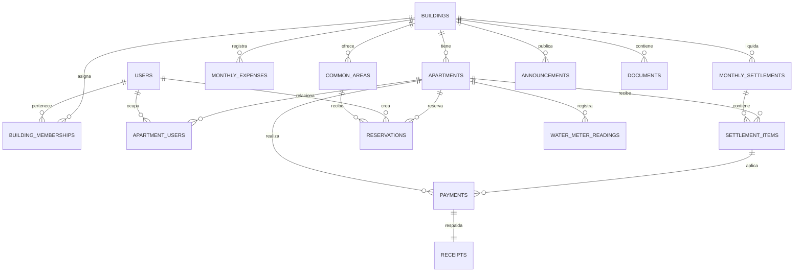

# EDIFLEX — Plan de arquitectura backend en Momen

## Resumen

El backend se implementará posteriormente en Momen con PostgreSQL, autenticación, permisos, Action Flows y GraphQL. El modelo soportará varios edificios por usuario mediante asignaciones, mantendrá el aislamiento de datos por edificio y calculará liquidaciones mensuales automáticas según el porcentaje de participación de cada departamento.

## Tablas y campos

Todas las tablas tendrán `id` UUID, `created_at`, `updated_at` y, cuando aplique, `created_by`.

| Tabla | Campos principales |
|---|---|
| **users** | `id` vinculado a la identidad de Momen, `full_name`, `email`, `phone`, `global_role` (`standard`, `super_admin`), `status` (`active`, `inactive`). |
| **buildings** | `name`, `address`, `city`, `country`, `currency`, `status` (`active`, `inactive`), `settings`. |
| **building_memberships** | `building_id`, `user_id`, `role` (`resident`, `administrator`), `status`. Define qué edificios puede consultar o administrar cada usuario. |
| **apartments** | `building_id`, `code`, `floor`, `owner_name`, `participation_percentage`, `status` (`active`, `inactive`). El porcentaje pertenece al departamento y todos los departamentos activos deben sumar 100 %. |
| **apartment_users** | `apartment_id`, `user_id`, `relationship` (`owner`, `resident`), `status`. Permite que un usuario tenga varios departamentos y que un departamento tenga varios residentes o propietarios. |
| **monthly_expenses** | `building_id`, `period` (`YYYY-MM`), `concept`, `amount`, `status` (`draft`, `included`, `void`), `registered_by`. |
| **monthly_settlements** | `building_id`, `period`, `total_expenses`, `status` (`draft`, `published`, `cancelled`), `generated_by`, `published_at`. Un registro por edificio y periodo. |
| **settlement_items** | `settlement_id`, `apartment_id`, `participation_percentage`, `amount_due`, `amount_paid`, `status` (`pending`, `partially_paid`, `paid`, `overdue`). |
| **payments** | `apartment_id`, `settlement_item_id`, `amount`, `payment_date`, `method`, `status` (`submitted`, `validated`, `rejected`), `submitted_by`, `validated_by`, `validation_note`. |
| **receipts** | `payment_id`, `file_key`, `file_name`, `mime_type`, `uploaded_at`. Un comprobante por pago en V1. |
| **common_areas** | `building_id`, `name`, `description`, `capacity`, `booking_mode` (`instant`, `approval_required`), `open_time`, `close_time`, `max_duration_minutes`, `status`. |
| **reservations** | `common_area_id`, `apartment_id`, `resident_id`, `start_at`, `end_at`, `status` (`pending`, `confirmed`, `rejected`, `cancelled`), `decision_by`, `decision_note`, `cancelled_at`. |
| **announcements** | `building_id`, `title`, `body`, `priority` (`normal`, `high`), `status` (`draft`, `published`, `archived`), `published_at`, `published_by`. |
| **documents** | `building_id`, `title`, `description`, `category`, `file_key`, `file_name`, `mime_type`, `status` (`published`, `archived`), `uploaded_by`, `published_at`. |
| **water_meter_readings** | `apartment_id`, `period`, `previous_reading`, `current_reading`, `consumption`, `reading_date`, `registered_by`. Un registro por departamento y periodo. |
| **platform_settings** | `key`, `value`, `description`, `updated_by`. Solo contiene configuración global de plataforma. |

### Reglas de integridad

- Un departamento solo pertenece a un edificio; pagos, lecturas y liquidaciones siempre se resuelven por esa relación.
- Un usuario estándar accede a edificios mediante `building_memberships` y a departamentos mediante `apartment_users`.
- Un usuario `super_admin` no requiere pertenencia a un edificio.
- La liquidación se genera con `total de gastos × porcentaje de participación / 100`.
- Solo se publica si los porcentajes de departamentos activos suman 100 %. Los importes se redondean a dos decimales; cualquier diferencia de redondeo se asigna de forma determinista al departamento con mayor porcentaje de participación.
- No se podrá registrar una lectura negativa, ni una lectura actual menor que la anterior.
- No podrán existir reservas activas que se solapen para la misma área común.

## Mapa de relaciones

## Permisos esperados

- **Residente**
  - Solo puede leer su perfil, sus asignaciones, sus departamentos, sus estados de cuenta, pagos, comprobantes, reservas, lecturas, documentos y comunicados del edificio al que está asignado.
  - Puede registrar pagos con comprobante, crear reservas y cancelar únicamente sus propias reservas antes de su inicio.
  - No puede ver datos de otros departamentos, ni crear o modificar información administrativa.

- **Administrador**
  - Solo opera sobre edificios donde posee una membresía activa con rol `administrator`.
  - Gestiona departamentos, residentes asignados, gastos mensuales, liquidaciones, pagos, reservas, áreas comunes, comunicados, documentos y lecturas de agua de sus edificios.
  - No puede acceder ni modificar información de edificios no asignados.

- **Superadministrador**
  - Gestiona edificios, usuarios administradores y configuración de plataforma.
  - Puede consultar información de todos los edificios para soporte y auditoría.
  - La edición de operaciones diarias de un edificio se mantiene reservada a sus administradores asignados.

Los permisos se aplicarán en Momen en dos niveles: reglas de acceso a tablas y filtros obligatorios en consultas/mutaciones GraphQL según `building_memberships`, `apartment_users` y `global_role`.

## Action Flows necesarios

| Action Flow | Actor | Resultado y validaciones |
|---|---|---|
| **Registrar pago** | Residente | Crea un pago `submitted`, carga el comprobante y lo vincula a una cuota pendiente de su departamento. |
| **Validar pago** | Administrador | Valida o rechaza un pago de su edificio; al validar, actualiza el saldo pagado de la cuota. |
| **Registrar gasto mensual** | Administrador | Crea o edita un gasto en borrador para un edificio y periodo propio. |
| **Generar liquidación mensual** | Administrador | Suma gastos vigentes, valida el 100 % de participación y genera cuotas por departamento en borrador. |
| **Publicar liquidación** | Administrador | Publica la liquidación y habilita su consulta y pago por residentes. |
| **Crear reserva** | Residente | Verifica pertenencia, horario y ausencia de solape; confirma de inmediato o deja pendiente según el área. |
| **Cancelar reserva** | Residente / Administrador | Cancela una reserva propia o una reserva del edificio administrado, registrando trazabilidad. |
| **Publicar comunicado** | Administrador | Publica un comunicado de su edificio y lo vuelve visible a sus residentes. |
| **Subir documento** | Administrador | Guarda archivo y metadatos, y publica el documento para su edificio. |
| **Registrar lectura de agua** | Administrador | Registra lectura válida de un departamento de su edificio y calcula consumo. |
| **Crear edificio** | Superadministrador | Crea un edificio activo con su configuración inicial. |
| **Asignar administrador** | Superadministrador | Crea o actualiza la membresía de edificio con rol `administrator`. |

## Plan de implementación por fases

1. **Base de identidad y alcance**
   - Configurar autenticación de Momen y tablas `users`, `buildings`, `building_memberships`, `apartments` y `apartment_users`.
   - Implementar índices, claves foráneas, estados y reglas de acceso por edificio.
   - Verificar que un residente y un administrador no puedan consultar otro edificio.

2. **Cobranza y liquidación**
   - Implementar gastos, liquidaciones, detalle por departamento, pagos y comprobantes.
   - Implementar los Action Flows de gasto, generación/publicación de liquidación, registro y validación de pago.
   - Verificar cálculo por porcentaje, suma de participación al 100 %, redondeo, pagos parciales y rechazo de comprobantes.

3. **Operación del edificio**
   - Implementar áreas comunes, reservas, comunicados, documentos y lecturas de agua.
   - Implementar los Action Flows correspondientes y almacenamiento de archivos.
   - Verificar solapes de reserva, modos inmediato/aprobación, aislamiento de documentos y cálculo de consumo.

4. **Administración de plataforma**
   - Implementar gestión de edificios, asignaciones administrativas y configuración global.
   - Agregar auditoría de acciones sensibles y consultas GraphQL para dashboards.
   - Verificar que Super Admin gestione edificios y administradores, sin otorgar permisos operativos no deseados.

5. **Validación y preparación de integración**
   - Definir consultas y mutaciones GraphQL consumidas por React, sin exponer campos fuera del alcance del rol.
   - Probar cada Action Flow con casos autorizados, no autorizados y datos inválidos.
   - Validar rendimiento de listados por edificio, trazabilidad y recuperación consistente de errores.

## Supuestos

- Momen proveerá el usuario autenticado y almacenamiento seguro de comprobantes/documentos.
- La moneda y reglas fiscales no forman parte de V1; los montos se manejan como importes monetarios de dos decimales.
- No se implementarán pasarela de pago, banca, facturación fiscal, gastos prorrateados por otra regla distinta al porcentaje de participación, IA, chat, QR, visitantes, paquetes ni gastos personales.
